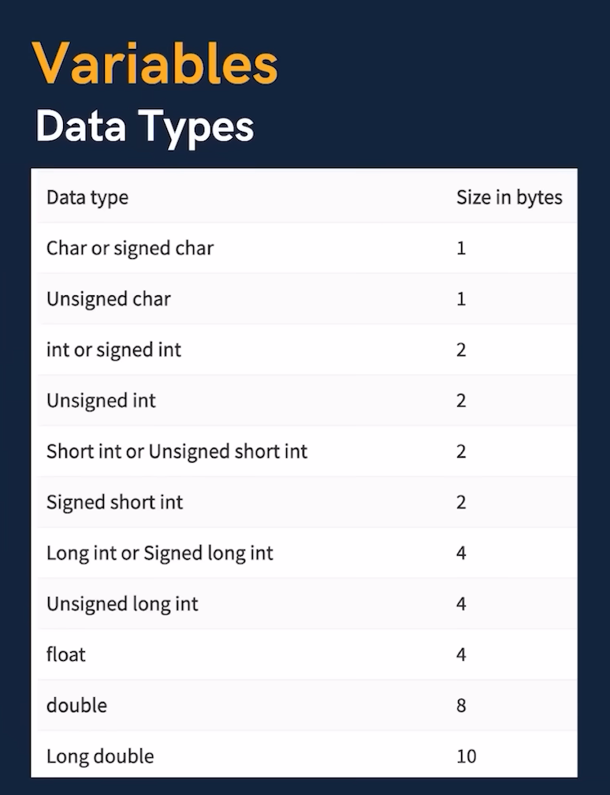
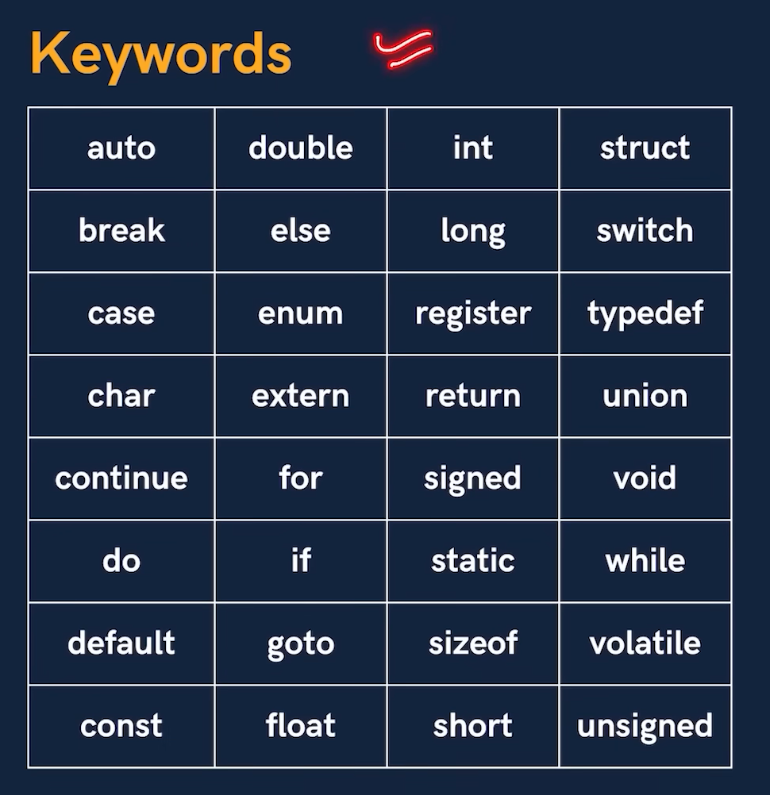
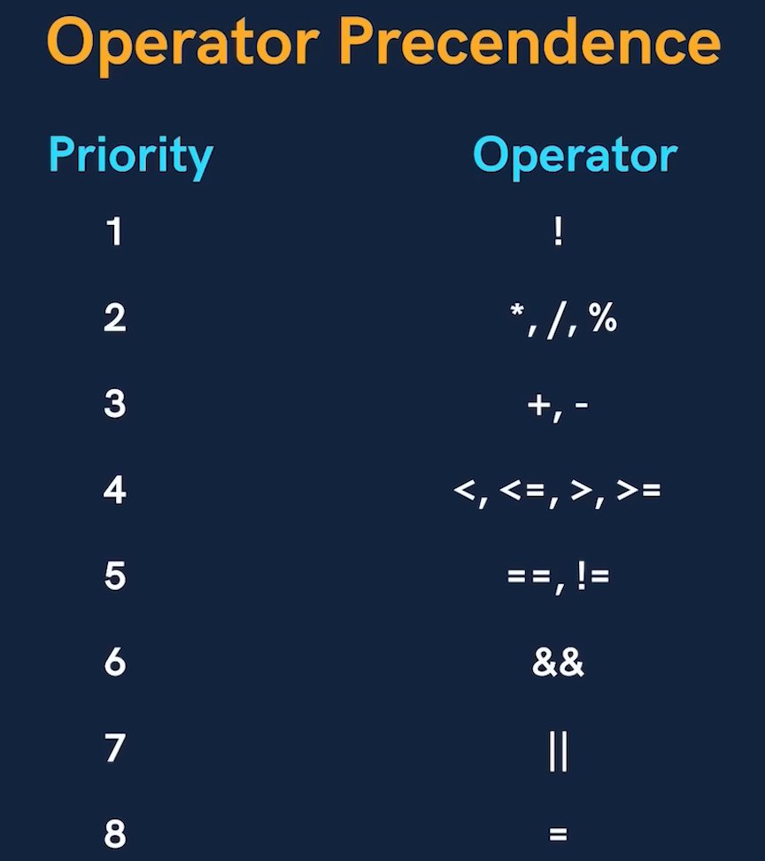

# C Language
- C doesn't have boolean or string data type.
- C language was developed by Dennis Ritchie.
- C language features include simplicity, efficiency, portability, extensibility, a rich standard library, dynamic memory management, modularity, and low-level memory manipulation capabilities. 

## Variable
- Variable is the name of a memory location which stores some data.

### Rules
- Variables are case sensitive.
- 1st character is alphabet or '_'.
- no comma / blank space
- No other symbol other than '_'.

### Data Types

type                    size
char                      1
int                       2
float                     4
double                    8

## Constants
- values that don't change (fixed).

Types 
- Integer constants
- Real constants
- Character constants

## Keywords

- Reserved words that have special meaning to the compiler.
- 32 Keywords in C.

## Program Structure
- #include <stdio.h>    ---> Pre-processor directive

## Comments
- Lines that are not part of the program.

### Types
- Single line  { // }
- Multiple line   {  /**/  }

## Output
printf("Hello World")

CASES
1. Integers  
printf("age is %d", age);

2. Real numbers  
printf("Value of pi is %f", pi);

3. Characters  
printf("star looks like this %c", star)

## Input
scanf("%d", &age);  
& -> denotes the address

## Compilation
- A computer program that translates C code into machine code.

Hello.c ---> C Compiler  ---> a.exe (windows) / a.out (linux and mac)

## Instructions
These are statements in a program.

Types  
- Type Declaration  --> Declare variable before using it.
- Arithmetic Instructions 
- Control Instructions

### Type conversion
- int op int --> int
- float op int --> float
- float op float --> float

conversion types = implicit and explicit

### Control Instructions
used to determine the flow of program.
1. sequence control
2. decision control
3. loop control
4. case control

## Operator Precedence

Priority            Operator  
1                       !  
2                      *,/,%  
3                      +,-  
4                     <,<=,>,>=  
5                       ==, !=   
6                       &&  
7                       ||  
8                       =

- Associativity (for same precedence) from left to right calculation for the same precedence.

## Operators
1. Arithmetic op
2. Relational op
3. Logical op
4. Ternary op
5. Assignment op
6. Bitwise op

## Conditional Statements
- if-else
- switch  
-- Cases can be in any order.  
-- nested switch (switch inside switch) are allowed.

Ternary Operator :  
Condition ? doSomething if True : doSomething if False;

## Loop Control Instructions
- To repeat some parts of the program.

Types  
- for
- while
- do-while

Break Statement - exit the loop (even nested ones)
Continue Statement - skips the present iteration / skip to next iteration

## Function 
- Block of code that performs a particular task.
- Execution always starts from main.
- a function gets called directly or indirectly from main.
- There can be multiple functions in a program.
- Function can take some values (parameters) and give some value (return value).
- Function can only return one value at a time.
- Changing to parameters in function don't change the values in calling function. (Beacuse a copy of argument is passed to the function).

Take argument ---> Do Work ---> Return Result

- it can be used multiple times.
- increase code reusability

Syntax

###  Function Prototype / Declaration
void printHello();

### Function Definition
void printHello() {  
    printf("Hello");  
} 

### Function Call
int main() {  
    printHello();
    return 0;
}

### Function types
- Library Functions  -- Special functions inbuilt in C
- User defined functions  -- declared and defined by programmer

### Passing arguments
Functions can take value and give some value.

// Argument vs Parameter
/*  Values that are passed in function call.        Values in function decalaration and definition.
    Used to send value                              Used to receive value 
    Actual parameters                               Formal parameters           */

## Recursion 
- When a function calls itself, it is called recursion.
- Anything that can be done with iteration can be done with recursion and vice versa.
- Recursion can sometimes give the most simple solution.
- Base case is the condition which stops recursion.
- Iteration has infinite loop and recursion has stack overflow.

## Pointers
- A variable that stores the memory address of another variable.
- * -> value at address opertor
- & -> Address of 

### Pointer to Pointer 
- A variable that stores the memory address of another pointer.

### Pointers in Function Call
- Call By Value - We pass value of variable as argument
- Call By Reference - We pass address of variable as argument

### Pointer Arithmetic 
- Pointer can be incremented and decremented.
- We can also subtract one pointer from another.
- We can also compare 2 pointers.

## Arrays 
- Collection of similar data types stored at contiguous memory locations.

### Array is a pointer
int *ptr = &arr[0];  
or
int *ptr = arr;

### Arrays as function argument 

Function Declaration  :  
void printNumnbers(int arr[], int n) {}  
or   
void printNumbers(int *arr, int n) {}  

Function Call  :  
printNumbers(arr, n);

### MultiDimensional Arrays
2D Arrays   
int arr[][] = {{1, 2, 3}, {4, 5, 6}};       // declaration of the array

While passing multidimensional arrays to the parameters in a function, we need to define the size of the second array as the first array is taken as a pointer but not the second one.

## Strings
A character array terminated by a null character '\0'.

- null character denotes string termination.
- gets(str) --> input a string even multiword.   (dangerous and outdated)
- puts(str) --> output a string
- fgets(str, n, file) --> stops when n-1 chars input or new line is entered.
- string automatically adds the null character at the end.
- Scanf cannot input multi word strings with spaces.
- Here, gets() and puts() come into picture.   
- name is an array which is a pointer, so it doesn't need to be written with an ampersand.

### string using pointers.

char *str = "Hello world\n";

- store string in the memory and the assigned address is stored in the char pointer 'str'.
puts(str);

str = "Hello\n"; // Can be reinitialized
puts(str);

// char str[] = "Hello world\n"; // Cannot be reinitialized

### Standard Library Functions <string.h>
1. strlen(str)  
count number of characters excluding '\0'.

2. strcpy(newStr, oldStr)  
copies value of old string to new string.

3. strcat(firstStr, secStr)  
concatenates first string with second string.

4. strcmp(firstStr, secStr)
compares 2 strings and returns a value.

0 -> string equal  
positive -> first > second (ASCII)  
negative -> first < second (ASCII)

## Structures
A collection of values of different data types.

Syntax : 

struct student {
    char name[100];
    int roll;
    float cgpa;
};

struct student s1;  
s1.cgpa = 7.5;

- structures are stored in contiguous memory locations. 

### Array of Structures
- struct student ECE[100];

Access : 
ECE[0].roll = 200;

### Initializing Structures
struct student s1 = {"Shraddha", 1664, 7.9};

### Pointers to structures
struct student s1;  
struct student *ptr;
ptr = &s1;

### Arrow Operator
(*ptr).code     <--->    ptr -> code

### Passing structure to function
- Function Prototype  
void printInfo(struct student s1);

Structures go by call by value.

### typedef keyword
- used to create alias for data types

typedef struct ComputerEngineeringStudent {
    int roll;
    float cgpa;
    char name[100];
} coe;

coe student1;

## File Input / Output
FILE - container in a storage device to store data

- RAM is volatile.
- Contents are lost when program terminates.
- Files are used to persist the data.

### Operation on files
- Create a file
- Open a file 
- Close a file
- Read from a file
- Write in a file

### Types Of Files
- Text Files --> textual data
- Binary Files --> binary data

### File Pointer
-  File is a (hidden) structure that needs to be created for opening a file.
-  A file ptr that points to this structure & is used to access the file
-  FILE *fptr;

## Dynamic Memory Allocation
- It is a way to allocate memory to a data structure during the runtime.
- We need some functions to allocate and free memory dynamically.

### Functions for DMA
1. malloc()
2. calloc()
3. free()
4. realloc()

### Malloc (Memory Allocation)
- takes number of bytes to be allocated and returns a pointer of type void

ptr = (*int) malloc(5 * sizeof(int));

### Calloc() (Continuous Allocation)
- Initializes with 0

ptr = (int*) calloc(5, sizeof(int));

5 = locations
sizeof(int) = size per location

### free()
- We use it to free memory that is allocated using malloc and calloc

free(ptr);

### realloc()
- Reallocate (increase or decrease) memory using the same pointer and size.

ptr = reallocate(ptr, newSize);